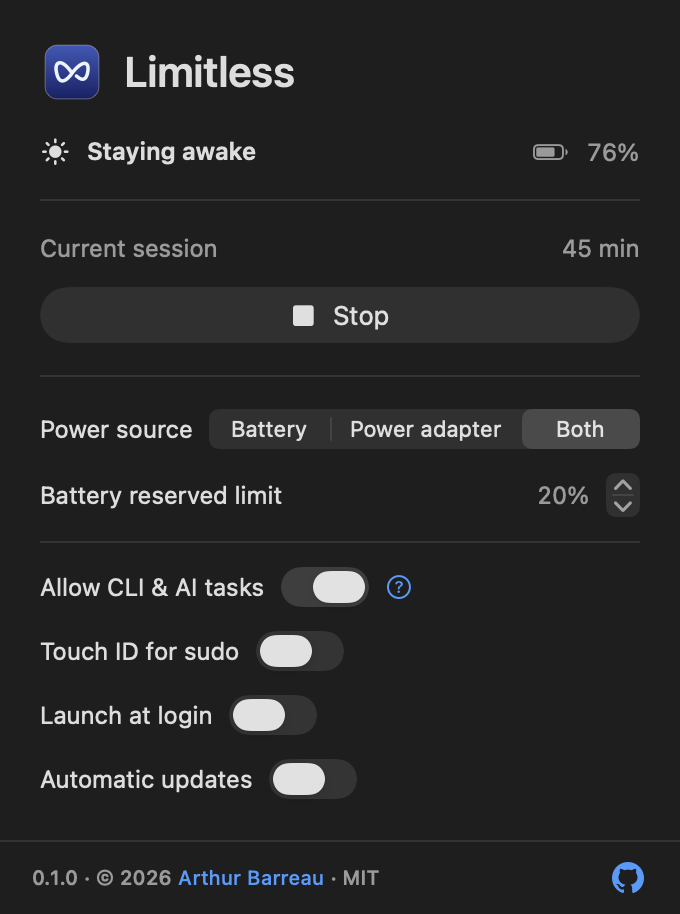

# Limitless

**Keep your Mac awake for the time or task you choose.**

[](https://github.com/leboonducoin/Limitless/actions/workflows/ci.yml)
[](https://github.com/leboonducoin/Limitless/actions/workflows/security.yml)
[](LICENSE)
[](docs/requirements.md)

I made Limitless as a small, native menu-bar utility. Choose a duration, follow a
process, or let your AI agent keep the Mac awake while it works. Everything lives
in one compact menu.

<p align="center">
  
</p>

*Earlier development preview with sample values.*

## What it does

- Keeps the Mac awake, including with the lid closed where the Mac and macOS allow it.
- Stops after a timer, at a date, when selected processes finish, or when you press Stop.
- Supports battery, power adapter, or both. Battery protection defaults to 20%.
- Follows CLI commands and entire agent tasks. Your manual session takes priority over AI.
- Checks the applied power state every two seconds and reports problems.
- Offers independent launch at login and optional GitHub updates.

The app, CLI and helper are written in Swift. No Node or Python runtime is needed.

## Install

**A public download is not available yet.** Local test builds exist; release
qualification is still in progress. Downloads will be on
[GitHub Releases](https://github.com/leboonducoin/Limitless/releases).

Unzip `Limitless.app`, move it to **Applications**, then open it. The icon appears
in the menu bar. Enable the helper through the app's macOS administrator prompt.
Your password is never stored. Users do not need an Apple Developer account.

The initial release targets **Apple Silicon, macOS 26+**. Non-notarized builds may
need a manual macOS opening decision; managed Macs can block them. See
[installation and signing](docs/distribution.md).

## Use it

Choose when to stop, then click **Keep awake**. An orange dot means protection is
active. Click outside to close the panel. Right-click the icon to quit or uninstall.
Uninstall removes the helper, preferences, cache and app-owned CLI shortcut.

Enable **Allow CLI & AI tasks** to use the bundled command directly:

```sh
limitless run -- swift test
limitless watch --pid 12345
limitless status
```

[CLI options and AI setup →](docs/cli.md)

## Limits

Closed-lid behavior relies on the undocumented global `pmset disablesleep` setting,
alongside Apple's `caffeinate`. Compatibility needs a real-Mac test. Limitless
does not stop battery drain or override user limits. Ordinary restart requests can
be deferred during a session; forced or managed restarts cannot be guaranteed.

## Development

```sh
swift Tools/ProjectTool.swift check
```

See [contributing](CONTRIBUTING.md), [architecture](docs/architecture.md),
[tests](docs/testing.md), [design](docs/design.md), and
[release acceptance](docs/requirements.md). Report vulnerabilities
[privately](https://github.com/leboonducoin/Limitless/security/advisories/new).

Inspired by [Sleepless](https://github.com/Aboudjem/Sleepless), independently
implemented without its code or assets.

By [Arthur Barreau](https://www.linkedin.com/in/arthurbarreau/).
[MIT](LICENSE) · Copyright © 2026 Arthur Barreau.
