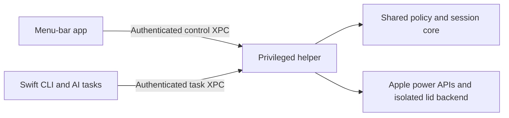

# Limitless

**A little more time.** A native macOS menu-bar app that keeps your Mac awake for
the time or work you choose.

[](https://github.com/leboonducoin/Limitless/actions/workflows/ci.yml)
[](https://github.com/leboonducoin/Limitless/actions/workflows/security.yml)
[](LICENSE)
[](docs/requirements.md)

[Preview](#preview) · [Features](#what-limitless-does) · [Installation](#installation-and-signing) · [CLI & AI](#cli-and-ai-tasks) · [Development](#development) · [Documentation](#project-documentation)

By **Arthur Barreau**. [MIT](LICENSE), copyright © 2026 Arthur Barreau.

**In development — not yet a published or hardware-qualified application.**
The first release targets **macOS 26 or later on Apple Silicon**. The app, CLI,
helper and distribution tooling are implemented, but there is no qualified public
download or Homebrew tap yet. Local signed trials verified native installation,
live battery keep-awake, concurrent tasks and restoration/removal. Physical
closed-lid operation, clean-Mac distribution and the remaining security scenarios
are still release gates. See the [acceptance matrix](docs/requirements.md).

Limitless is an independent Swift implementation inspired by
[Sleepless](https://github.com/Aboudjem/Sleepless). No Sleepless code or assets are
included. Public Apple APIs handle idle-sleep assertions, power information,
native authorization and process tracking. The undocumented global
`pmset disablesleep` mechanism is isolated in one backend for lid-closed operation
where the hardware and macOS permit it, without requiring an external display.

## Preview

<p align="center">
  
</p>

Native macOS capture from the read-only development preview. The displayed
battery and session values are sample data; controls are disabled. This shows the
interface, not proof of closed-lid operation. Manual hardware testing and interface
refinements are being handled by the maintainer before a public binary release.

## What Limitless does

| Control | Behavior |
| --- | --- |
| Power source | Battery only (`-b`), power adapter only (`-c`), or both (`-a`); exactly one mode at a time |
| Battery protection | Every integer from 0–50%; default 20%. A value of 0 disables custom protection and shows a warning |
| Automatic stop | 13 presets from five minutes to 24 hours, custom duration, date/time, process completion, or no time limit |
| Tracked commands | The Swift CLI holds a session while its foreground command exists and releases it on completion |
| Concurrent work | Each task owns its session; the last eligible task releases the automatic hold |
| Observed state | Displays confirmed, suspended, restoring and unavailable states; recovery has a bounded retry budget |
| Login | Launch at login is independent of enabling keep-awake; active sessions never return after login or reboot |

The SwiftUI/AppKit interface uses native materials, system typography and original
icon artwork. The application, CLI, helper and maintenance tools are Swift, with
no third-party Swift package dependency and **no Node or Python product runtime**.

## How it works



The helper enforces user limits on every request. Your commands run in the
unprivileged CLI; the helper accepts no arbitrary command or filesystem path.
See the [architecture](docs/architecture.md) and [security policy](SECURITY.md).

## Installation and signing

Distribution is planned through GitHub releases and a dedicated Homebrew tap.
There is no valid `brew install` command or release download to advertise yet.

The community channel uses a stable publisher certificate and native macOS
administrator consent without requiring paid Apple Developer membership from
the maintainer or users. Users will receive the already signed app; they will not
need to build it or create a certificate. Developer ID and notarization are an
optional later channel. The community installer and packaging are implemented;
the local signed installation/active-removal cycle passed without paid membership
or added certificate trust. Clean-Mac download/Homebrew qualification is pending.

A downloaded non-notarized app may require an explicit decision in macOS Privacy
& Security, and managed Macs may prevent opening it. Limitless and its cask do not
remove quarantine or change Gatekeeper. Ad-hoc development builds cannot enable
the helper or change power settings. See [distribution and trust](docs/distribution.md).

## Using a qualified installation

These steps describe the implemented controls; they are not a claim that the
current development bundle is ready for privileged use.

1. Open Limitless and choose **Enable Limitless**. macOS handles helper approval;
   the app never asks for or stores your administrator password itself.
2. In Settings, choose power sources and battery/duration limits, then **Apply limits**.
   Enabling **Launch at login** does not start a session.
3. Choose the menu panel's stop condition and start a session. A mismatched power
   source suspends it; returning to an allowed source can resume it before its deadline.
4. Use **Stop all** to revoke all current demands. Expiry, battery cutoff and
   explicit stop end affected sessions; recovery cannot revive them.

Stopping protection permits ordinary sleep. It does not force sleep or terminate
your command. If restoration is unconfirmed, keep the app installed and follow
its status guidance instead of assuming that quitting or rebooting fixed the flag.

### CLI and AI tasks

After installing the signed helper and explicitly allowing tracked tasks in Settings:

```sh
limitless status --json
limitless run -c --for 90m -- swift test
limitless run -a --unlimited -- my-command
limitless watch -b --battery-floor 30 --pid 12345
```

Replace the command and PID with work you actually want to follow. CLI and AI
requests can tighten your limits, never relax them. A foreground command's exit
code is preserved. Process observation checks PID, owner and start time; it never
kills the observed process. Commands are launched as your user, without elevation.

The [AI skill](skills/limitless/SKILL.md) uses the same CLI. Each concurrent task
must be tracked separately; an idle agent host, dummy command or detached wrapper
is not evidence of ongoing work. A separate manual session remains independent.
See [CLI syntax, signals and tracking limits](docs/cli.md).

## Removal and upgrades

Use **Settings → Prepare for removal…** before deleting a working installation.
This ends sessions, confirms restoration of owned state, removes the helper and
login registration, and checks the result. Commands themselves keep running.
Optional preference removal is separate. If cleanup fails, keep the matching app
and retry; do not delete the protected journal manually.

The Homebrew recipe uses this guarded removal hook and stops if it fails. Upgrades
also remove the old integrations: reopen the new app to enable the helper, login
and automation again. No session is restored automatically. See the complete
[removal and recovery procedure](docs/distribution.md#prepare-for-removal).

## Development

Use the Apple Swift toolchain on macOS. CI checks Xcode 26.2 compatibility and runs
sanitizers with Xcode 26.6; local checks also pass with Command Line Tools Swift 6.4.
Commands below use the project's
RTK development wrapper, which is not part of the delivered application.

```sh
rtk proxy env LIMITLESS_BUILD_PATH=/private/tmp/limitless-build swift Tools/ProjectTool.swift check
rtk proxy env LIMITLESS_BUILD_PATH=/private/tmp/limitless-build LIMITLESS_OUTPUT_DIR=/private/tmp/limitless-preview swift Tools/ProjectTool.swift bundle
```

The output directory must be new; existing files are never replaced. Keeping
build artifacts outside a synced Desktop avoids FileProvider signing interference.
`bundle` creates an ad-hoc inspection app without registering a helper or login item.
The Debug app supports read-only native previews:

```sh
rtk proxy /private/tmp/limitless-preview/Limitless.app/Contents/MacOS/LimitlessApp --preview active
```

Use `community-bundle` to inspect the alternative helper layout. Signed release
commands are documented separately and require an actual signing identity.
Every push to `main` runs GitHub Actions: Release builds and tests, separate
Address/Thread Sanitizer runs, both development bundle layouts, workflow linting,
secret scanning and CodeQL for Swift and Actions. Pull requests also run dependency
review; security checks run weekly. The badges above link to the actual results.
CI never installs a privileged helper or changes the runner's power settings.
See [testing and observed results](docs/testing.md) for the exact checks and manual
acceptance gates. A green workflow does not certify physical Mac compatibility.

## Project documentation

- [Requirements and acceptance tracking](docs/requirements.md)
- [Architecture and behavior](docs/architecture.md)
- [CLI and AI integration](docs/cli.md)
- [Native interface contract](docs/design.md)
- [Build, installation and removal](docs/distribution.md)
- [Security policy](SECURITY.md)
- [Testing and evidence](docs/testing.md)
- [Contributing](CONTRIBUTING.md)
- [Code of conduct](CODE_OF_CONDUCT.md)
- [Agent instructions](AGENTS.md)

## Safety boundary

Lid-closed support depends on the Mac and macOS version. Reading a power flag is
not proof of physical operation. Limitless must not claim that an unverified
change succeeded. `disablesleep` is global: `-b` and `-c` are policies enforced by
Limitless as power changes, not independent OS settings. Missing telemetry cannot
be treated as successful protection or restoration. Another privileged utility
can interfere with this global flag, and helper/OS failure can delay cleanup.

No claim of thermal safety or universal closed-lid compatibility is made. Physical
acceptance includes the Mac model, exact OS version, battery/AC transitions,
crashes and confirmed restoration. Do not run privileged experiments without
their explicit authorization and restoration procedure.

## Contributing and reporting problems

Follow [CONTRIBUTING.md](CONTRIBUTING.md) for focused changes and validation.
Bug reports should identify the app commit/version, macOS version, Mac model,
power conditions and observed result, without serial numbers or private commands.
Report security vulnerabilities privately through [SECURITY.md](SECURITY.md).
The [changelog](CHANGELOG.md) records implemented work; it does not imply a release.
